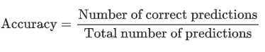
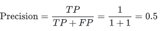

# Accuracy

The accuracy is the total number of correctly predicted points, divided by the total number of predictions (total number of data in the test dataset). 



## Implementation

```python
labels = [1, 0, 0, 1, 1, 1, 0, 1, 1, 1]
guesses = [0, 1, 1, 1, 1, 0, 1, 0, 1, 0]

true_positives = 0
true_negatives = 0
false_positives = 0
false_negatives = 0

for i in range(len(guesses)):
  #True Positives
  if labels[i] == 1 and guesses[i] == 1:
    true_positives += 1
  #True Negatives
  if labels[i] == 0 and guesses[i] == 0:
    true_negatives += 1
  #False Positives
  if labels[i] == 0 and guesses[i] == 1:
    false_positives += 1
  #False Negatives
  if labels[i] == 1 and guesses[i] == 0:
    false_negatives += 1
    
accuracy = (true_positives + true_negatives) / len(guesses)
print(accuracy)
```

### Recall

Accuracy is not everything! A model can be very accurate and still not working well, e.g. if the number of true positive is low and the model predicts mostly true negative the accuracy becomes close to one. But it still does not predict one true positive correct.  

```python
recall = true_positives/(true_positives+false_negatives)
```


## Precision

The precision of a model gives how good the model can predict True Positives. The best would be 1.

- TP: True Positive
- FP: False Positive



```python
precision = true_positives / (true_positives + false_positives)
```

## F1 Score

the F1 Score combines recall and precision to one number so that only one number is required as an indicator for the models functionality. Therefore the harmonic mean is calculated, not the common arithmetic mean. The arithmetic mean's weakness is that it cannot deal good with a big difference between precision and accuracy. 

Example:

- recall = 1
- precision = 0.01

arithmetic mean: 

(1 + 0.01) / 2 = 0.505

harmonic mean: 

2 * ((1 * 0.01) / (1 + 0.01)) = 0.019

The optimal F1 Score would be 1

```python
f_1 = 2 * ((recall * precision)/ (recall + precision))
```

# Scikit-Learn implementation

Scikit-learn has all these functions for you ready to use.


```python
from sklearn.metrics import accuracy_score, recall_score, precision_score, f1_score

labels = [1, 0, 0, 1, 1, 1, 0, 1, 1, 1] ## True Values
guesses = [0, 1, 1, 1, 1, 0, 1, 0, 1, 0] ## Predicted Values

print(accuracy_score(labels, guesses))
print(recall_score(labels, guesses))
print(precision_score(labels, guesses))
print(f1_score(labels, guesses))
```

# Resources

https://developers.google.com/machine-learning/crash-course/classification/accuracy

https://developers.google.com/machine-learning/crash-course/classification/precision-and-recall

https://en.wikipedia.org/wiki/Precision_and_recall