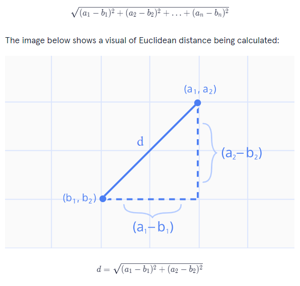

# K-nearest neighbors

Can be implemented as an algorithm, which will classify data points, so that they can be grouped together. 

In essence the algorithm needs to calculate the distance to all surrounding points and then see if the point rather belongs to class n or n+y, different distance formulas can be used, like the Euclidean Distance, Manhattan Distance and Hamming Distance. The most common used distance is the Euclidean Distance, which is the root of the sum of square differences.ö



The three steps of the k algo

1. Normalize the data
2. Find the k nearest neighbors
3. Classify the new point based on those neighbors

## Step 1 normalize the data

it is important that all data points have the same impact on the model. Hence the data need to normalized, which means all values are brought to a number between 0 and 1. See the following python implementation. 

```python
def min_max_normalize(lst):
  minimum = min(lst)
  maximum = max(lst)
  normalized = [(lst[i]-minimum)/(maximum-minimum) for i in range(len(lst))]
  return normalized
```

## Step 2 k-nearest Neighbors

to find the nearest neighbors the euclidean distance is calculated, see following equation:


source: https://www.tutorialexample.com/calculate-euclidean-distance-in-tensorflow-a-step-guide-tensorflow-tutorial/

in code with multiple dimensions: 

```python
def distance(movie1, movie2):
  return (sum([(movie1[i]-movie2[i])**2 for i in range(len(movie1))]))**0.5
```

1. Calculate the nearest distance
2. sort them naturally from 0 to 1 e.g. in python `.sort()`
3. return th k-nearest neighbors

```python
def classify(unknown, dataset, k):
  distances = []
  for title in dataset:
    distance_to_point = distance(dataset[title], unknown)
    distances.append([distance_to_point, title])
    distances.sort()
  return distances[0:k]
```

### Step 3 classify the neighbors