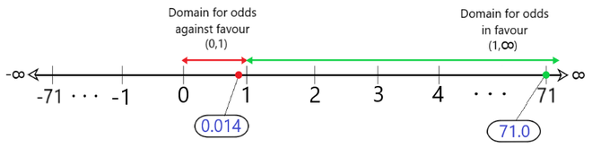
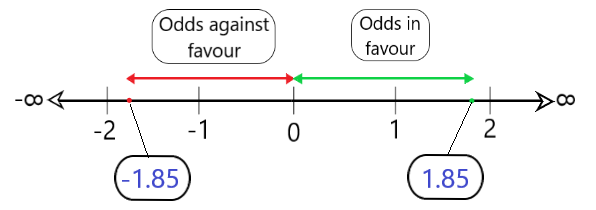
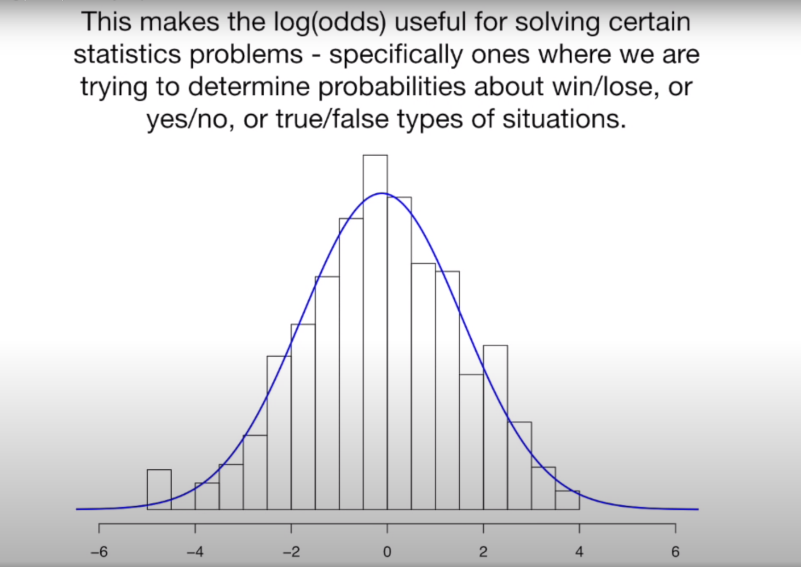
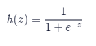

# Logistic Regression

Logistic Regression is supervised learning algorithm. It utilizes regression to predict the continuous probability, which ranges from 0 to 1. Based on the probability the point is <strong>classified</strong> to the more probable group. Hence, the <strong>Logistic Regression is a classification algorithm</strong>. A good example would be a email spam filter. Logistic Regression is used when the required curve needs a "logistic fit". 

## Hands on Logistic Regression

1. Initialize all feature coefficients and intercept with 0
2. calculate the log-odd of every feature by multiplying each feature coefficient by their respective feature value
3. use the sigmoid function to place the log-odds into the probability range between 0 and 1

### Log-Odds

Let me point first to this video https://www.youtube.com/watch?v=ARfXDSkQf1Y it showed me very well what the problem is about.  

First let us define odds! The odds are the fraction of the probability that something will happen and the counter part that something will not happen. An example would be the odds of a sports game, the odds (chance, prospects) are 1:4 that team A will win. This means that the probability of wining is 20%.

Calculate the probability: 

p = 1 / (1 + 4) = 0.2 

However the odds are:

odds = 1 / 4 = 0.25 

odds = p(Event A) / p(Event B) -> p(Event A) / 1 - p(Event A) -> 0.2 / 0.8 = 0.25

Simplification:

```math
odds = p / (1 - p)
```

Now that we understood probability and odd dependency, let us talk about the problem of odds. The main weakness is that if the probability of something will happening (Event A) is fairly small it becomes negligible, because its odd will be very small (0 to 1), however the opposing event scales up to infinity (1 to infinity). 


source: https://www.geeksforgeeks.org/log-odds/

However if you take the logarithm of the odds then everything is scaled equally:


source: https://www.geeksforgeeks.org/log-odds/

In fact this means that all possible odds are stretched to a normal distribution.


source: https://www.youtube.com/watch?v=ARfXDSkQf1Y


## Code implementation for machine learning

### Log-Loss

*insert notes*

### Log-Loss coefficient

https://www.youtube.com/watch?v=vN5cNN2-HWE 


```python
import numpy as np

def log_odds(features, coefficient, intercept):
  return np.dot(features, coefficient) + intercept
```

## Sigmoid Function

The sigmoid function maps the log-odds to a range of 0 to 1. 




```python
import numpy as np

def sigmoid(z): # z = array of log-odds
  denominator = 1 + np.exp(-z)
  return 1/denominator
```


# Resources

Cheatsheet https://www.codecademy.com/learn/paths/machine-learning/tracks/introduction-to-supervised-learning-skill-path/modules/logistic-regression-skill-path/cheatsheet

https://towardsdatascience.com/https-towardsdatascience-com-what-and-why-of-log-odds-64ba988bf704

https://www.youtube.com/watch?v=ARfXDSkQf1Y

https://www.geeksforgeeks.org/log-odds/
