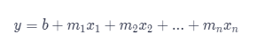

# Multiple linear regression

Linear regression is useful if only one value can vary.
However in many real world examples multiple values will influence the true out coming value.

Hence it is important to use <strong>multiple linear regression</strong>

It is based on this formula:


## Review


- it works just as two variable linear regression, just with more variables
- It uses a set of independent variables to learn how to find the optimal parameters (parameters are the m values and the intercept value b)
- The learning process is done by labeled data, and is done after the operator confirms via Residual value or coefficient  of determination value the model precision
- scikit-learn `LinearRegression()` can be used to perform either multiple or single linear regression
- Residual analysis is used to evaluate the model's accuracy
- scikit-learn comes with a `.score(x, y)` methode which returns 

### Equations

The mathematical general approach for multiple-linear-regression is: 



To evaluate the models accuracy two values can be calculated - the residual e or the <strong>coefficient of determination R<sup>2</sup></strong> 

y is the actual value and ŷ is the predicted value from the model


u is the sum of the square difference of y values minus y_predicted and v is the sum of the square difference of y values minus y mean 


u:
```python
((y - y_predict) ** 2).sum()
```
v:
```python
((y - y.mean()) ** 2).sum()
```

